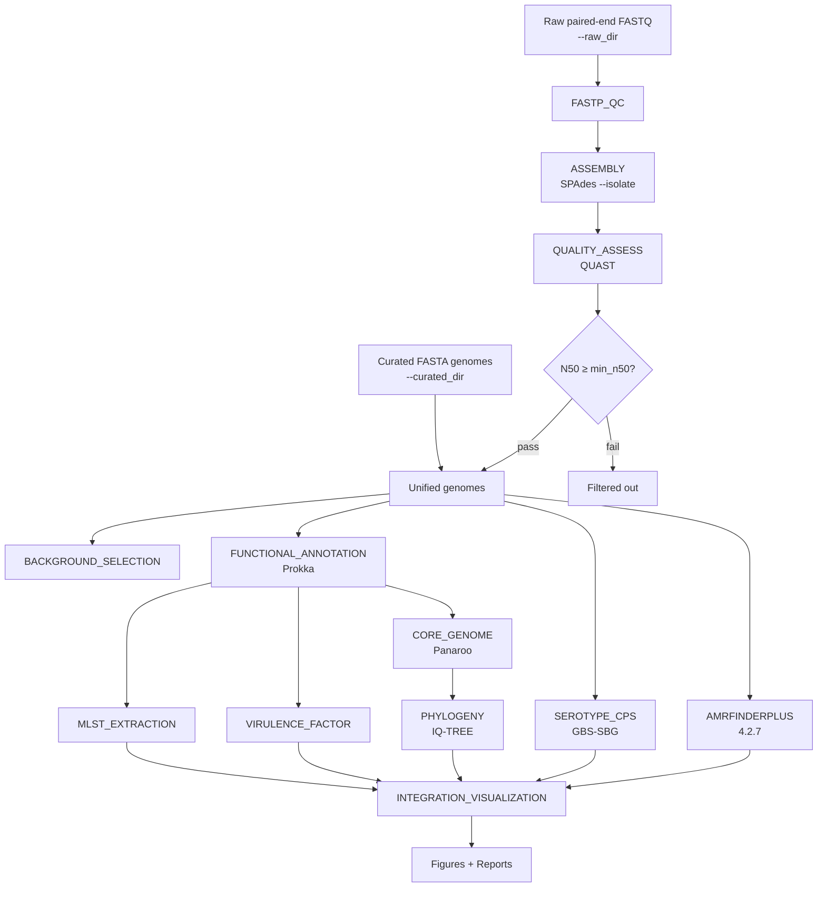

# GBS-Sentinel

[](https://www.nextflow.io/)
[](https://hub.docker.com/r/kizitodevbio/strepto-pipeline)
[](LICENSE)

**GBS-Sentinel** is a Nextflow DSL2 workflow for genomic surveillance of *Streptococcus agalactiae* (Group B Streptococcus, GBS). It accepts either paired-end Illumina FASTQ reads or pre-assembled FASTA genomes and produces sequence types, capsular serotypes, antimicrobial-resistance determinants, virulence profiles, core-genome relationships, and integrated surveillance summaries.

GBS-Sentinel extends the earlier [GBS-Genomics-Pipeline](https://github.com/kizito-devbio/GBS-Genomics-Pipeline) by adding GBS-specific capsular serotyping (GBS-SBG) and standardized resistome detection with AMRFinderPlus, while retaining QC, assembly, annotation, MLST, virulence profiling, core-genome analysis, phylogeny, and visualization.

---

## Overview

Group B Streptococcus remains a major cause of neonatal sepsis and an important target of maternal immunization research. Genomic surveillance supports:

- tracking of circulating sequence types (MLST)
- monitoring of capsular serotype distributions relevant to vaccine composition
- detection of antimicrobial-resistance determinants
- characterization of virulence-associated genes
- assessment of genomic relatedness through core-genome and phylogenetic analysis

GBS-Sentinel brings these dimensions into a single, containerized, reproducible workflow designed for use in research and surveillance settings, including environments with limited computational infrastructure.

### What the workflow does

| Dimension | Implementation |
|-----------|----------------|
| Sequence quality | fastp |
| Genome assembly | SPAdes (`--isolate`) |
| Assembly quality | QUAST + N50 filtering |
| Functional annotation | Prokka |
| MLST | `mlst` (scheme `sagalactiae`) |
| Capsular serotyping | GBS-SBG (assembly-based BLASTN) |
| Antimicrobial resistance | AMRFinderPlus 4.2.7 |
| Virulence factors | Abricate / VFDB pathway (existing module) |
| Core genome | Panaroo |
| Phylogeny | IQ-TREE (from core-genome alignment) |
| Reporting / figures | Python visualization stage |

Human-genome decontamination is **not** part of the active workflow (modules retained under `modules/frozen/`).

---

## Workflow



### Input pathways

**Raw-read pathway** (`--raw_dir`)

1. Paired-end FASTQ detection (multiple Illumina naming patterns)
2. Quality control and trimming (fastp)
3. Assembly (SPAdes `--isolate`)
4. Assembly quality assessment (QUAST)
5. Filtering on N50 (`--min_n50`, default 10 000)
6. Downstream genomic characterization

**Curated-genome pathway** (`--curated_dir`)

1. FASTA detection (`*.fa`, `*.fna`, `*.fasta`)
2. Direct entry into downstream genomic characterization (skips QC and assembly)

Exactly one of `--raw_dir` or `--curated_dir` must be supplied.

---

## Supported inputs

### Raw paired-end reads

Place paired FASTQ files in a single directory. Supported naming patterns:

```
sample_1.fastq / sample_2.fastq
sample_1.fastq.gz / sample_2.fastq.gz
sample_R1.fastq / sample_R2.fastq
sample_R1.fastq.gz / sample_R2.fastq.gz
sample_1.fq / sample_2.fq
sample_1.fq.gz / sample_2.fq.gz
sample_R1.fq / sample_R2.fq
sample_R1.fq.gz / sample_R2.fq.gz
```

Example:

```text
african_raw_reads/
├── GBS_AF01_1.fastq.gz
├── GBS_AF01_2.fastq.gz
├── GBS_AF02_1.fastq.gz
├── GBS_AF02_2.fastq.gz
└── ...
```

### Curated / pre-assembled genomes

```text
curated_genomes/
├── GBS_isolate_01.fasta
├── GBS_isolate_02.fna
└── GBS_isolate_03.fa
```

Supported extensions: `.fa`, `.fna`, `.fasta`.

---

## Quick start

### Prerequisites

- [Nextflow](https://www.nextflow.io/) ≥ 23 (tested with 26.04.3)
- Docker (recommended) **or** Singularity/Apptainer **or** Conda
- Sufficient disk space for intermediate assemblies and container layers

### Clone the repository

```bash
git clone https://github.com/kizito-devbio/GBS-Sentinel.git
cd GBS-Sentinel
```

### Run with raw reads (Docker)

```bash
nextflow run pipeline.nf \
  -profile docker \
  --raw_dir african_raw_reads \
  --outdir results_africa_raw \
  --max_cpus 8 \
  --max_memory '16 GB' \
  --amrfinder_cpus 2 \
  --amrfinder_memory '12 GB'
```

### Run with curated genomes (Docker)

```bash
nextflow run pipeline.nf \
  -profile docker \
  --curated_dir curated_genomes \
  --outdir results_curated
```

### Resume an interrupted run

```bash
nextflow run pipeline.nf \
  -profile docker \
  --raw_dir african_raw_reads \
  --outdir results_africa_raw \
  -resume
```

### Help

```bash
nextflow run pipeline.nf --help
```

---

## Configuration and parameters

Key user-facing parameters (from `nextflow.config` and `pipeline.nf`):

| Parameter | Default | Purpose |
|-----------|---------|---------|
| `--raw_dir` | `false` | Directory of paired-end FASTQ files |
| `--curated_dir` | `false` | Directory of pre-assembled FASTA genomes |
| `--outdir` | `./results` | Output directory |
| `--mlst_scheme` | `sagalactiae` | MLST scheme |
| `--min_n50` | `10000` | Minimum N50 for raw-read assemblies to proceed |
| `--min_length` | `1800000` | Minimum expected genome length (bp) |
| `--max_length` | `2400000` | Maximum expected genome length (bp) |
| `--max_contigs` | `200` | Maximum contig count |
| `--max_cpus` | `8` | Maximum CPUs for high-compute processes |
| `--max_memory` | `16 GB` | Maximum memory for high-compute processes |
| `--amrfinder_cpus` | `4` | CPUs per AMRFinderPlus task |
| `--amrfinder_memory` | `14 GB` | Memory per AMRFinderPlus task |
| `--amrfinder_max_forks` | `1` | Maximum concurrent AMRFinderPlus tasks |
| `--skip_tbl2asn` | `true` | Skip tbl2asn during Prokka annotation |
| `--help` | `false` | Print help and exit |

Resource parameters control process allocation, not the number of samples.

### Profiles

| Profile | Description |
|---------|-------------|
| `docker` | Primary validated profile; uses `kizitodevbio/strepto-pipeline:v1.2.0` |
| `singularity` | Singularity/Apptainer execution |
| `conda` | Conda environments (where defined) |
| `cluster` | Generic cluster settings (combine with docker or singularity) |
| `test` | Lightweight test profile |

Docker is the currently validated production profile for end-to-end surveillance runs.

---

## Pipeline modules

| Module | Process | Role |
|--------|---------|------|
| `modules/qc.nf` | `FASTP_QC` | Read QC and trimming |
| `modules/assembly.nf` | `ASSEMBLY` | SPAdes isolate-mode assembly |
| `modules/quality_assess.nf` | `QUALITY_ASSESS` | QUAST metrics + N50 filtering |
| `modules/background_selection.nf` | `BACKGROUND_SELECTION` | Background genome selection for context |
| `modules/functional_annotation.nf` | `FUNCTIONAL_ANNOTATION` | Prokka annotation |
| `modules/mlst_extraction.nf` | `MLST_EXTRACTION` | MLST (`sagalactiae`) |
| `modules/serotyping/serotype_cps.nf` | `SEROTYPE_CPS` | GBS-SBG capsular serotyping |
| `modules/amrfinderplus/amrfinderplus.nf` | `AMRFINDERPLUS` | AMRFinderPlus resistome detection |
| `modules/virulence_factor.nf` | `VIRULENCE_FACTOR` | Virulence-factor screening |
| `modules/core_genome.nf` | `CORE_GENOME` | Panaroo core-genome analysis |
| `modules/phylogeny.nf` | `PHYLOGENY` | Phylogenetic inference from core alignment |
| `modules/integration_visualization.nf` | `INTEGRATION_VISUALIZATION` | Integrated figures and reports |

Disabled modules (human decontamination) are stored under `modules/frozen/`.

---

## Output structure

Typical output layout (exact contents depend on input pathway and sample count):

```text
results/
├── QC/                          # fastp reports (raw pathway)
├── Assembly/                    # SPAdes contigs + QUAST reports
├── AMR/                         # *_amrfinder.tsv (AMRFinderPlus)
├── Serotyping/                  # *_serotype.tsv (GBS-SBG)
├── Virulence/                   # virulence screening results
├── MLST/                        # sequence type results
├── CoreGenome/                  # Panaroo core-genome outputs
├── Phylogeny/                   # tree files (Newick)
├── Figures/                     # integrated surveillance figures
├── Reports/                     # summary tables / background selection
└── Logs/                        # per-process logs
```

### Key result files

- **AMR** – `${sample}_amrfinder.tsv`  
  Gene, class, subclass, method, and identity information from AMRFinderPlus.

- **Serotyping** – `${sample}_serotype.tsv`  
  Columns: `sample_id`, `serotype`, `best_match`, `confidence`, `status`.

- **MLST** – sample-specific sequence type assignments.

- **Phylogeny** – Newick tree derived from the core-genome alignment (requires sufficient genomes).

- **Figures / Reports** – combined visualizations produced by `bin/generate_figures.py` from the collected surveillance dimensions.

---

## AMR surveillance (AMRFinderPlus)

- **Software**: AMRFinderPlus 4.2.7 (bundled in the container)
- **Organism context**: *Streptococcus agalactiae*
- **Input**: assembled / curated nucleotide FASTA
- **Database**: prepared AMRFinderPlus database inside the container (validated before each run; missing/unusable DB causes hard failure rather than empty results)
- **Outputs**: `${sample}_amrfinder.tsv` + log
- **Resources**: controlled independently via `--amrfinder_cpus`, `--amrfinder_memory`, and `--amrfinder_max_forks`

AMRFinderPlus is the primary resistome module in GBS-Sentinel. Results are passed directly into the final visualization stage.

Detection of a resistance determinant is a genomic observation and does not by itself establish phenotypic resistance.

---

## Capsular serotyping (GBS-SBG)

- **Method**: GBS-SBG (GBS Serotyping by Genome Sequencing)
- **Type**: assembly-based BLASTN against the curated GBS-SBG reference
- **Location in container**: `/opt/GBS-SBG/GBS-SBG.pl` and `/opt/GBS-SBG/GBS-SBG.fasta`
- **Output schema**: `sample_id`, `serotype`, `best_match`, `confidence`, `status`

Capsular type is epidemiologically relevant for GBS (including vaccine-preparedness research). Serotype assignment depends on the quality of the assembly and the completeness of the cps locus representation in the genome.

---

## MLST

MLST is performed with the `sagalactiae` scheme (configurable via `--mlst_scheme`). Sequence types provide a standardized view of population structure and are integrated into the final surveillance figures.

---

## Core genome and phylogeny

- Core-genome analysis uses Panaroo on Prokka GFF files.
- Phylogeny is inferred from the core-genome alignment.
- With very few genomes the core-genome / phylogeny stages handle the limited sample set without crashing the pipeline; phylogenetic interpretation is only meaningful when sufficient high-quality genomes are available.

Phylogenetic relationships depend on dataset composition, genome quality, core definition, and analytical parameters.

---

## Reproducibility

- Nextflow DSL2 with process isolation
- Primary container: `kizitodevbio/strepto-pipeline:v1.2.0`
- Per-process logging (stage, inputs, software versions, elapsed time)
- `-resume` support for interrupted runs
- Explicit resource ceilings for general processes and for AMRFinderPlus

---

## Performance example

An observed end-to-end execution:

| Item | Value |
|------|--------|
| Dataset | 20 African GBS genomes (raw paired-end) |
| Command | `nextflow run pipeline.nf -profile docker --raw_dir african_raw_reads --outdir results_africa_raw --max_cpus 8 --max_memory '16 GB' --amrfinder_cpus 2 --amrfinder_memory '12 GB'` |
| Nextflow | 26.04.3 |
| Container | `kizitodevbio/strepto-pipeline:v1.2.0` |
| Approximate wall time | ~8 hours |

This is an observed run on a local workstation. Runtime scales with sequencing depth, number of samples, assembly complexity, available CPU/RAM, storage performance, and Docker overhead. It is not a performance guarantee.

---

## Troubleshooting

| Problem | Likely cause / action |
|---------|------------------------|
| “No input supplied” | Provide exactly one of `--raw_dir` or `--curated_dir` |
| No paired-end FASTQ found | Check naming patterns listed under Supported inputs |
| Assembly fails or low N50 | Inspect SPAdes logs; adjust `--min_n50` if appropriate |
| AMRFinderPlus OOM / slow | Increase `--amrfinder_memory`; keep `--amrfinder_max_forks 1` on smaller machines |
| Missing serotype / low confidence | Check assembly completeness around the cps locus; review `*_serotype.tsv` status |
| Phylogeny empty or skipped | Too few genomes passed quality filters |
| Docker permission errors | Ensure the user can run Docker; check group membership |
| Interrupted run | Re-launch with `-resume` |

---

## Known limitations

- Downstream results depend on assembly quality (especially for serotyping and core-genome analysis).
- MLST and serotype databases are finite; novel alleles or incomplete cps loci may yield no match or low confidence.
- AMR and virulence gene detection report genomic presence, not phenotypic expression or clinical outcome.
- Core-genome phylogeny requires multiple high-quality genomes; single-sample or very small datasets have limited phylogenetic value.
- Human decontamination is disabled; the workflow assumes bacterial culture or low-host-content libraries.
- AMRFinderPlus can be memory-intensive (BLASTX); concurrent tasks are limited by design.

---

## Scientific interpretation note

Detection of a resistance, virulence, or capsule-associated determinant is a genomic observation. It does not by itself establish phenotypic expression, clinical resistance, pathogenicity, or vaccine effectiveness. Phylogenetic relationships depend on the genomes included, their quality, the core-genome definition, and the inference parameters. Interpret results in the appropriate epidemiological and laboratory context.

---

## Citation

If you use GBS-Sentinel, please cite the repository:

```text
Kizito DevBio. GBS-Sentinel.
https://github.com/kizito-devbio/GBS-Sentinel
```

Also cite the major upstream tools used by the workflow (Nextflow, SPAdes, Prokka, AMRFinderPlus, GBS-SBG, Panaroo, IQ-TREE, etc.) according to their respective publications.

See `CITATION.cff` for machine-readable citation metadata (currently still linked to the foundation GBS-Genomics-Pipeline project).

---

## License

MIT License — see [LICENSE](LICENSE).

---

## Contributing

See [CONTRIBUTING.md](CONTRIBUTING.md) and [CODE_OF_CONDUCT.md](CODE_OF_CONDUCT.md).

---

## Links

- **GBS-Sentinel**: https://github.com/kizito-devbio/GBS-Sentinel
- **Foundation pipeline**: https://github.com/kizito-devbio/GBS-Genomics-Pipeline
- **Docker image**: https://hub.docker.com/r/kizitodevbio/strepto-pipeline
- **Nextflow**: https://www.nextflow.io/

---

*GBS-Sentinel — genomic surveillance for Streptococcus agalactiae*
